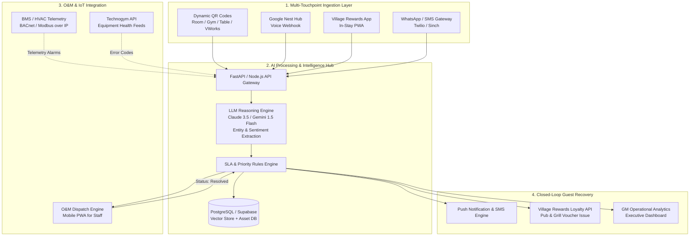

# Strategic Project Report: Real-Time Customer Feedback & AI-Driven O&M Assistance
**Target Organization:** Village Hotels (UK)  
**Initiative:** Closed-Loop Real-Time Feedback & Intelligent Operation & Maintenance (O&M) Hub  
**Document Version:** 1.0 (GROW Hackathon Team 8 Architecture & Strategy)  
**Date:** September 2026  

---

## 1. Executive Summary

Village Hotels operates a distinctive, high-footfall "hub" hospitality model across 33 UK properties. Unlike conventional hotels, each Village property acts as a multifaceted community epicenter combining:
1. **Lifestyle Hotel Accommodations** (~120–160 rooms per site)
2. **Village Gym & Wellness Clubs** (typically 3,500–5,000 local members per club, pool, steam/sauna, spin/studio classes)
3. **Village Pub & Grill** and **on-site Starbucks** franchises
4. **VWorks Coworking & Meeting Hubs** (hot desks, meeting pods, conference facilities)

While Village Hotels is an industry pioneer in customer-facing digital touchpoints (self-service check-in kiosks, mobile keycards, Village Rewards app, Google Nest Hubs in selected club rooms), a critical operational divide persists: **a disconnect between real-time guest feedback and immediate back-of-house Operation & Maintenance (O&M) execution.**

### The Core Opportunity
Guests and gym members rarely report minor issues (e.g., erratic room air conditioning, loose fixtures, slow Wi-Fi in VWorks, or malfunctioning gym equipment) during their stay due to friction or perceived futility. Instead, friction silently compounds until it manifests as:
- **Public negative reviews** on TripAdvisor, Google, and Booking.com (damaging RevPAR and direct bookings).
- **Escalating repair costs** because minor asset defects are left to cause major hardware failure.
- **Lost lifetime value** of high-margin local gym and coworking memberships.

This report outlines the blueprint for a **unified, AI-powered Real-Time Feedback and O&M Assistance Platform** designed specifically for Village Hotels. The system ingests frictionless feedback across all guest touchpoints, instantly categorizes and prioritizes issues using Generative NLP, auto-dispatches intelligent work orders to on-duty staff, and executes a closed-loop resolution protocol before the customer departs.

---

## 2. Village Hotels: Current State & Brand Ecosystem

### 2.1 The Multi-Stakeholder Environment
Every Village Hotel location manages four parallel customer segments with distinct expectations and dwell times:

| Segment | Primary Facilities | Typical Dwell Time | Critical Pain Points & Expectations |
| :--- | :--- | :--- | :--- |
| **Hotel Guests (Leisure & Business)** | Bedrooms, Pub & Grill, Pool/Gym | 1–3 Nights | Room temperature (HVAC), shower pressure, sleep quality, seamless Wi-Fi, prompt room issue resolution. |
| **Gym & Leisure Club Members** | Village Gym, Studios, Pool, Changing Rooms | 1–2 Hours (3–5x/week) | Technogym machine uptime, shower/locker cleanliness, studio temperature, water dispenser status. |
| **VWorks Coworking Professionals** | Hot Desks, Meeting Rooms, Starbucks | Full Day / Recurring | High-speed Wi-Fi reliability, ClickShare screen pairing, power outlets, acoustic privacy, coffee service. |
| **F&B & Event Visitors** | Pub & Grill, Event Suites, Weddings | 2–5 Hours | Order wait times, food temperature, sports screen audio/video, restroom cleanliness. |

```
                       ┌────────────────────────────────────────────────────────┐
                       │               VILLAGE HOTEL "HUB" ECOSYSTEM            │
                       └────────────────────────────────────────────────────────┘
                                                    │
         ┌───────────────────┬──────────────────────┴────────────────────┬───────────────────┐
         ▼                   ▼                                           ▼                   ▼
  ┌──────────────┐   ┌───────────────┐                            ┌─────────────┐     ┌──────────────┐
  │ Hotel Rooms  │   │  Village Gym  │                            │ Pub & Grill │     │ VWorks Co-op │
  │ (~150 Rooms) │   │ (3-5k Members)│                            │ & Starbucks │     │  & Meetings  │
  └──────┬───────┘   └───────┬───────┘                            └──────┬──────┘     └──────┬───────┘
         │                   │                                           │                   │
         └───────────────────┴──────────────────────┬────────────────────┴───────────────────┘
                                                    ▼
                       ┌────────────────────────────────────────────────────────┐
                       │         Current Gap: Fragmented Feedback & O&M          │
                       │   (Issues voiced on OTA reviews or left unaddressed)   │
                       └────────────────────────────────────────────────────────┘
```

### 2.2 Operational Realities & Recurring Review Pain Points
Empirical analysis of guest reviews across UK properties highlights recurring failure modes:
1. **HVAC & Climate Control Inconsistency:** The single most frequent guest complaint. In-room air conditioning units are often perceived as noisy, locked, unresponsive, or incapable of counteracting summer heat loads.
2. **Maintenance Response Latency:** When guests notify front desk staff via phone or kiosk, work orders are manually phoned or radioed to maintenance technicians. During peak check-in (16:00–19:00), staff bottlenecks lead to lost or delayed requests.
3. **Gym Equipment Wear & Tear:** With thousands of weekly visits on Technogym cardio machines, cables, and spin bikes, out-of-order equipment damages the local member value proposition if out of service for days without communication.
4. **The "Silent Checkout":** Up to 80% of dissatisfied guests simply check out via self-service kiosk or drop their keycard without speaking to a human, venting their dissatisfaction hours later on TripAdvisor or Google Reviews.

---

## 3. The Solution: Closed-Loop Feedback & O&M Assistance Platform

The proposed solution connects the guest directly to the physical operations of the property through an AI-mediated triage and dispatch engine.

```
┌─────────────────────────────────────────────────────────────────────────────────────────────────┐
│                                 END-TO-END SYSTEM FLOW                                          │
└─────────────────────────────────────────────────────────────────────────────────────────────────┘

  1. INGESTION                    2. AI TRIAGE & ENRICHMENT           3. O&M DISPATCH & RESOLUTION
 ┌──────────────────────┐        ┌────────────────────────────┐      ┌───────────────────────────┐
 │ • In-Room QR / Hub   │        │   NLP Intent & Urgency     │      │  Smart Mobile Dispatch    │
 │ • Gym Machine QR     ├───────►│        Extraction          ├─────►│  • Engineering / HVAC     │
 │ • Village App / SMS  │        │ • Sentiment / Tone (1-5)   │      │  • Housekeeping           │
 │ • VWorks Hotspot QR  │        │ • Asset & Room Mapping     │      │  • Leisure Club Ops       │
 └──────────────────────┘        └─────────────┬──────────────┘      └─────────────┬─────────────┘
                                               │                                   │
                                               ▼                                   ▼
                                 ┌────────────────────────────┐      ┌───────────────────────────┐
                                 │  Predictive / IoT Context  │      │ 4. CLOSED-LOOP RECOVERY   │
                                 │  • Technogym API status    │      │  • Guest Real-Time SMS    │
                                 │  • Building Management Sys │      │  • Pub & Grill Voucher    │
                                 │  • Historical Asset MTTR   │      │  • Verified Resolution    │
                                 └────────────────────────────┘      └───────────────────────────┘
```

### Pillar 1: Multimodal In-Stay Feedback Ingestion
Eliminate all friction in providing feedback:
- **Zero-Download Dynamic QR Codes:** Placed on bedroom desk tents, bathroom mirrors, VWorks desks, and individual gym machines. Scanning immediately opens a high-speed Progressive Web App (PWA) with the location context already pre-loaded (e.g., `Room 214`, `Treadmill #6`, `VWorks Pod 3`).
- **Google Nest Hub & In-Room Voice Integration:** Voice action: *"Hey Google, tell Village maintenance my room is too hot"* triggers the same webhook backend.
- **Village Rewards App Integration:** An in-stay notification card that activates during booked dates: *"How is your room settling in?"* (one-tap micro-survey).
- **Proactive Micro-Pulse Surveys:** Sent via SMS/WhatsApp 45 minutes after check-in: *"Quick check: Is everything in Room 312 to your satisfaction? (Reply 1 for Great, 2 for Needs Attention)"*.

### Pillar 2: AI Sentiment, Intent & Asset Entity Extraction
Raw customer input is unstructured, emotional, and often vague. The AI pipeline processes incoming text or voice notes through a specialized Large Language Model (LLM) fine-tuned for hotel operations:
- **Entity Extraction:** Identifies exact asset (`air_conditioning`, `shower_drain`, `tv_remote`, `dumbbells_missing`, `wifi_speed`).
- **Urgency Scoring (1 to 5):**
  - *Severity 5 (Immediate):* Water leak, door lock failure, total AC failure on high-heat day.
  - *Severity 3 (Moderate):* Missing extra towels, coffee pods, TV channel tuning issue.
  - *Severity 1 (Informational):* Gym music volume suggestion, breakfast suggestion.
- **Sentiment & Churn Risk Index:** Calculates real-time guest NPS risk score to flag high-value loyalty members or long-stay corporate accounts.

### Pillar 3: AI-Assisted Operation & Maintenance (O&M) Copilot
Maintenance staff need actionable intelligence, not ambiguous text messages:
- **Automated Work-Order Generation:** Formats the issue into a structured CMMS ticket:
  - *Location:* Floor 2, Room 214
  - *Diagnosed Issue:* Daikin VRV Fan Coil Unit unresponsive / error code E4
  - *Recommended Action / SOP:* Check breaker panel 2B, test thermostat reset sequence.
  - *Estimated Parts Required:* Standard thermostat fuse or sensor bypass.
- **Smart Routing & Load Balancing:** Tickets are assigned based on staff shift status, skill set (HVAC specialist vs general porter), and physical proximity on property.
- **Multimodal Visual Diagnostic for Staff:** Technicians can photograph faulty equipment, and the O&M Copilot identifies the part number, retrieves the digital maintenance manual, and displays recent maintenance history.

### Pillar 4: Autonomous Closed-Loop Service Recovery
Resolving the physical issue is only half the battle; ensuring the guest feels heard is what secures brand loyalty:
- **Transparent Status Updates:** The guest receives instant confirmation: *"Thanks, Sarah. We’ve dispatched our maintenance engineer (Mark) to look at the AC in Room 214. ETA: 12 minutes."*
- **Resolution Verification:** Once marked resolved by the technician, an automated ping asks the guest: *"Mark has reset your unit to 19°C. Does the room feel comfortable now?"*
- **Automated "Service Recovery" Vouchers:** If an issue took more than 30 minutes to resolve or reached Severity 4/5, the system automatically deposits a perk into their Village Rewards app account (e.g., *“Complimentary pint or cocktail at the Village Pub & Grill on us tonight”*), neutralizing dissatisfaction before checkout.

---

## 4. Technical Architecture & Tech Stack Recommendations



### Recommended Technology Stack for Hackathon & Production

| Component | Hackathon Prototype (MVP) | Production Enterprise Grade |
| :--- | :--- | :--- |
| **Frontend / Guest UI** | Next.js (React) + TailwindCSS PWA, optimized for mobile QR scanning. | Integrated into existing Village Hotels Native iOS/Android App & PWA. |
| **Backend API Gateway** | Python (FastAPI) or TypeScript (Node.js). | Containerized microservices on AWS ECS / Google Cloud Run. |
| **AI / NLP Engine** | Gemini 1.5 Flash or Claude 3.5 Sonnet (for fast entity extraction, sentiment, and JSON structured output). | Self-hosted fine-tuned LLM or enterprise cloud LLM with regional UK residency (GDPR compliance). |
| **Database & State** | Supabase (PostgreSQL with Row Level Security & Real-Time subscriptions). | Enterprise PostgreSQL RDS + Redis cache cluster. |
| **Staff Dispatch Interface** | Responsive Mobile Web App with audio alerts and push notifications. | Dedicated Staff PWA with offline caching & optional zebra scanner/wearable integration. |
| **Third-Party Integrations** | Mocked PMS (Opera/Cloudbeds), Mocked BMS & Technogym API. | Oracle Hospitality Opera PMS, Daikin/Trend BMS BACnet IP, Technogym Mywellness Cloud API. |

---

## 5. High-Impact Operational Use Cases

### Use Case 1: The "Locked Air Conditioning" in Room 418
1. **Trigger:** Guest scans desk QR code at 22:30: *"My room is freezing, thermostat won't let me turn the heat up above 18 degrees."*
2. **AI Action:** Classifies category: `HVAC_HEATING`, Urgency: `High (Nighttime)`, Guest Segment: `Corporate Stay`.
3. **Dispatch:** Night Duty Manager's handset vibrates with a 1-tap action card: *"Room 418 BMS override needed. Target: 21°C."*
4. **Resolution:** Night manager approves digital BMS override from their phone in 90 seconds without entering the room.
5. **Closed Loop:** System pings guest: *"We've adjusted your climate control remotely to 21°C. Please let us know if you need an extra duvet or heater!"*
6. **Result:** Prevents a 1-star TripAdvisor review complaining of an unheated room and zero staff assistance.

### Use Case 2: Broken Cable Machine in the Village Gym
1. **Trigger:** Local gym member scans QR code on Technogym Dual Adjustable Pulley: *"Right side cable is frayed and jammed."*
2. **AI Action:** Classifies category: `LEISURE_EQUIPMENT_CRITICAL`, Urgency: `Safety / Equipment Damage`.
3. **Dispatch:** Leisure Duty Manager receives alert. The system auto-generates a maintenance ticket with the part number (`Technogym Pulley Cable 2400mm`) and checks stock.
4. **O&M Action:** Staff flags machine as "Temporarily Under Inspection" on the digital gym display board to prevent injury.
5. **Closed Loop:** When member scans or logs into gym app later: *"Thanks for spotting this! Cable replaced and machine inspected."*
6. **Result:** Member feels valued, safety hazard averted, asset life preserved.

### Use Case 3: VWorks Coworking Wi-Fi Drops in Pod 4
1. **Trigger:** Remote worker scans desk QR code: *"Wi-Fi keeps dropping during my client Zoom call."*
2. **AI Action:** Classifies category: `IT_INFRASTRUCTURE`, Urgency: `Critical (Work Interruption)`.
3. **Dispatch:** Dedicated alert to on-site IT/Operations team with nearby access point diagnostics.
4. **Immediate Compensatory Recovery:** System instantly triggers an SMS with an alternative high-bandwidth 5G backup network SSID and an automated voucher for a free barista coffee at the on-site Starbucks.
5. **Result:** Turns a catastrophic client-facing work disruption into an exceptional hospitality recovery story.

---

## 6. Business Impact & ROI Projections

For a typical 33-hotel portfolio, implementing an integrated real-time feedback and O&M assistance system delivers measurable financial and operational returns:

```
  Metric                           Estimated Impact Across Portfolio
 ──────────────────────────────────────────────────────────────────
  TripAdvisor / Google Rating      +0.3 to +0.5 Star Average Increase
  Post-Stay Complaint Escalation   -45% Reduction in Public Negative Reviews
  Maintenance MTTR                 -58% Reduction in Mean Time to Repair
  Asset Lifecycle Extension        +15-20% Longer HVAC & Gym Asset Lifespan
  Member Churn (Village Gym)       -3.2% Reduction in Membership Cancellations
  RevPAR Uplift                    Estimated £1.2M - £1.8M Annually
```

### Financial Levers
1. **Reputation-Driven ADR (Average Daily Rate):** Cornell Hospitality Research demonstrates that a 1-point increase in a hotel's Global Review Index allows an operator to raise room rates by up to 1.4% without sacrificing occupancy.
2. **Labor Efficiency:** Eliminating radio chatter, phone tag, and paper logbooks saves an average of 45 minutes per maintenance technician per 8-hour shift.
3. **Preventive Savings:** Catching HVAC water leaks or condenser overheating early prevents tens of thousands of pounds in room water damage and emergency out-of-hours contractor callouts.

---

## 7. GROW Hackathon Team 8: MVP Execution Plan

To deliver a compelling, prize-winning demonstration for the Reply GROW Hackathon, Team 8 should focus on building a cohesive, end-to-end working prototype that showcases the full closed loop.

### Core MVP Deliverables (What to Build)

#### A. Guest Experience Layer (Mobile PWA)
- Fast, clean, mobile-optimized UI (using Village Hotels' signature black, white, and neon green/electric blue brand colors).
- Dynamic URL routing (`/stay?room=204`, `/gym?asset=treadmill3`, `/vworks?pod=2`).
- Voice note or quick text input + photo upload for broken items.

#### B. The "Village Brain" (AI Triage Backend)
- Live LLM pipeline with structured JSON schema output:
  - Extracted fields: `location`, `category`, `issue_summary`, `severity_score`, `assigned_department`, `recommended_sop`.
- Real-time sentiment detector with priority escalation for VIPs or distressed tone.

#### C. Staff O&M Copilot Dashboard (Desktop & Mobile View)
- Real-time kanban board of active issues across Rooms, Gym, F&B, and VWorks.
- 1-click status updates (`Dispatched`, `Investigating`, `Parts Needed`, `Resolved`).
- AI "Fix Suggestion" card detailing common causes and SOP instructions for the technician.

#### D. Live Closed-Loop Feedback Simulation
- Push notification / simulated SMS back to the guest when the technician resolves the ticket.
- Instant automated generation of a digital Pub & Grill drink voucher or Starbucks coffee perk to demonstrate the closed-loop recovery.

#### E. Management Insights Heatmap
- Live property floorplan or dashboard showing hot spots: Which rooms have recurring HVAC issues? Which gym machines break most frequently?

---

## 8. Conclusion & Strategic Next Steps

Village Hotels' identity as an all-in-one lifestyle and fitness hub is its greatest competitive advantage, but it also creates operational complexity that traditional hotel management software cannot handle.

By deploying an AI-powered, real-time feedback and maintenance copilot:
- **Guests** enjoy seamless, friction-free issue resolution and personalized recovery.
- **Staff** gain clarity, automated work orders, and digital diagnostics that eliminate chaos.
- **Management** secures higher review scores, reduced asset downtime, and protected revenue.

This document serves as the foundational architecture for the project. Team 8 is positioned to build a demonstrable, production-viable solution that aligns directly with Village Hotels' brand DNA.
