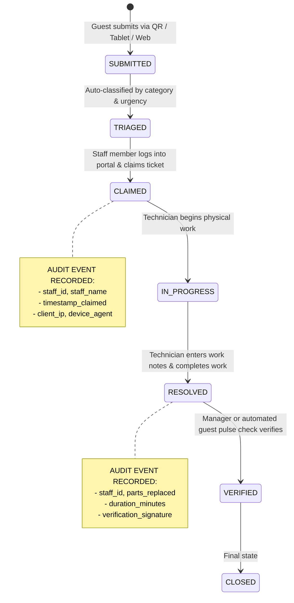
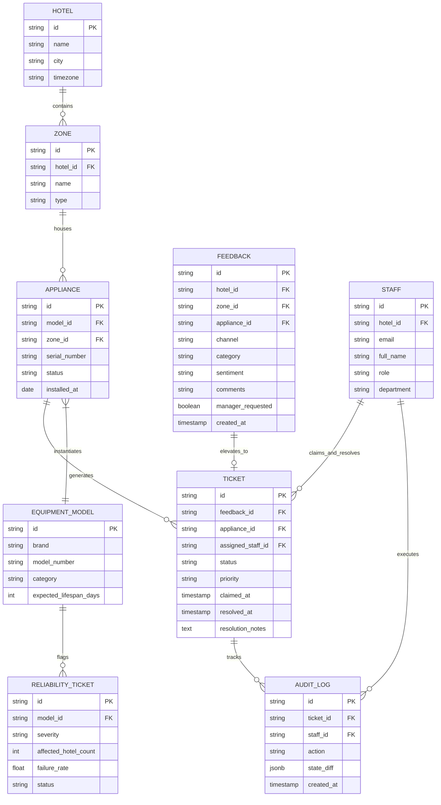

# Hotel & Spa Omnichannel Feedback & Fleet Reliability Platform

## Comprehensive System Design & Architecture Specification

**Document Version:** 1.0.0  
**Status:** Approved Architecture Draft  
**Target Platform:** Node.js (v20+ LTS / v22), Express.js, Shared Relational/Document Database, Semantic Accessible HTML5/CSS3/ES6

---

## 1. Executive Summary & Vision

The **Hotel & Spa Omnichannel Feedback & Fleet Reliability Platform** is an enterprise-grade guest experience, maintenance dispatch, and equipment intelligence system designed for multi-property luxury hotel and spa hospitality groups.

### Core Objectives

1. **Centralize Disjointed Feedback**: Unify guest feedback from multiple physical and digital touchpoints into a single, normalized, real-time shared database.
2. **Hybrid & Ultra-Simple Accessible Ingestion**: Deliver an effortless guest experience resolving the "iPads vs. QR Codes" debate through a hybrid model: communal area interactive kiosks (tablets) paired with appliance-specific QR codes with pre-seeded prompt trees.
3. **Rigorous Staff Accountability & Auditability**: Trace maintenance work and ticket resolution to specific authenticated personnel via a secure backend portal and immutable audit trail.
4. **Personalized Manager Service Recovery**: Escalate urgent guest queries and negative experiences to duty managers in real time for in-person or high-touch recovery.
5. **Cross-Property Equipment Fleet Intelligence**: Aggregate failure patterns across multiple hotel properties sharing common equipment brands/models to proactively flag reliability anomalies and trigger procurement reviews.

---

## 2. High-Level System Architecture

```mermaid
flowchart TB
    subgraph Ingestion_Layer["Omnichannel Guest & User Ingestion Layer"]
        Kiosk["Communal Tablets / iPads\n(Lobbies, Spa, Gyms)"]
        ApplianceQR["Appliance Contextual QR Codes\n(Coffee Machines, Bikes, HVAC)"]
        DirectWeb["Mobile Web / Room Portal\n(Open Feedback)"]
        FrontDesk["Front Desk Staff Direct Entry\n(Verbal Reports)"]
    end

    subgraph API_Gateway["Express Application & API Gateway"]
        AuthMiddleware["JWT / Session RBAC Auth Middleware"]
        RateLimiter["Rate Limiting & Security (Helmet)"]
        AuditLogger["Tamper-Evident Audit Logging Engine"]
        TriageEngine["Rule-Based Triage & Escalation Engine"]
        FleetEngine["Cross-Property Fleet Reliability Engine"]
    end

    subgraph Storage_Layer["Centralized Shared Data Tier"]
        DB[(Shared Centralized Database\nHotels | Assets | Tickets | Audits)]
    end

    subgraph Operational_Portals["Staff & Management Interfaces"]
        StaffPortal["Staff & Maintenance Portal\n(Ticket Claim, Work Logs, Sign-off)"]
        ManagerPortal["Manager Real-Time Escalation Dashboard\n(Personalized Guest Recovery)"]
        FleetDashboard["Group Fleet & Reliability Analytics\n(Cross-Hotel Brand Trend Alerts)"]
    end

    Kiosk -->|REST Ingestion| RateLimiter
    ApplianceQR -->|REST Ingestion| RateLimiter
    DirectWeb -->|REST Ingestion| RateLimiter
    FrontDesk -->|Authenticated REST| AuthMiddleware

    RateLimiter --> TriageEngine
    AuthMiddleware --> AuditLogger

    TriageEngine -->|Persist Feedback| DB
    TriageEngine -->|Generate Maintenance Ticket| DB
    TriageEngine -->|Urgent Guest Query Alert| ManagerPortal

    AuditLogger -->|Append Immutable Audit Event| DB
    FleetEngine -->|Scheduled Aggregation Query| DB
    FleetEngine -->|Proactive Fleet Investigation Ticket| FleetDashboard

    StaffPortal -->|Claim & Complete Maintenance| AuthMiddleware
    ManagerPortal -->|Log Personal Service Recovery| AuthMiddleware
    FleetDashboard -->|Review Fleet Anomaly Tickets| AuthMiddleware
```

---

## 3. Omnichannel Ingestion Strategy: Resolving "iPads vs. QR Codes"

### 3.1 The Trade-Off Analysis

| Criteria                 | Communal Tablets / Kiosks (e.g., iPads)                                                  | Appliance Contextual QR Codes                                                                           |
| :----------------------- | :--------------------------------------------------------------------------------------- | :------------------------------------------------------------------------------------------------------ |
| **Primary Placement**    | High-traffic public zones (Lobby, Spa reception, Gym entrance, Pool deck).               | Affixed directly to equipment (in-room espresso machines, stationary bikes, saunas, HVAC panels).       |
| **Guest Context**        | General impressions, atmospheric feedback, staff compliments, communal area cleanliness. | Highly specific, asset-aware operational status, immediate appliance breakdown.                         |
| **Friction Level**       | Zero personal device needed; walk up and tap.                                            | Requires personal smartphone camera; zero physical touch on shared screen.                              |
| **Hygiene / Perception** | Requires antimicrobial screen coatings and regular wipe-downs.                           | Touch-free; guest uses their own phone.                                                                 |
| **Accuracy of Data**     | Relies on guest typing or selecting location/zone manually.                              | 100% deterministic asset metadata passed via URL query parameters (`applianceId`, `hotelId`, `roomId`). |

### 3.2 The Hybrid Architecture Decision

Rather than choosing one over the other, the platform implements a **Coordinated Hybrid Model**:

1. **Communal Tablets (iPads)**:
   - Locked in kiosk mode with high-contrast, large-touch-target UI (minimum 48x48px targets).
   - Serves general experience ratings, room comfort reports ("Room is too hot/cold"), spa atmosphere feedback, and communal amenity requests.
   - Screen resets after 30 seconds of inactivity to protect guest privacy.
2. **Contextual Appliance QR Codes**:
   - Deployed with durable metal/matte stickers on individual equipment units.
   - Encodes a deterministic URL:  
     `https://feedback.hotelgroup.com/report?hotelId=H01&location=Gym&applianceId=BIKE-04&model=Peloton-V2`
   - Bypasses search/navigation: loads directly into a tailored, pre-seeded triage screen.

### 3.3 Appliance Pre-Seeded Prompt Trees

When scanning an appliance QR code, the guest is presented with tailored, one-tap primary buttons representing 80% of common failure modes, plus an open "Other / Details" text area:

```
[ Appliance QR Scanned: Hotel 1 -> Room 402 -> Nespresso Vertuo ]
                      │
     ┌────────────────┴────────────────┐
     ▼                                 ▼
[Pre-Seeded Quick Prompts]     [Freeform "Report Anything"]
  ├─ "Out of Milk / Pods"        ├─ Text description
  ├─ "Water Not Heating"         ├─ Voice-to-text / Audio note
  ├─ "Machine Leaking"           └─ Photo upload (optional)
  └─ "Descaling Light On"
```

---

## 4. Staff Accountability & Maintenance Audit Trail

### 4.1 The Business Need

In luxury hotel and spa operations, maintenance issues often get marked as "resolved" without verification, or tickets linger unassigned. When maintenance work fails or is disputed, management must have an undeniable, chronological paper trail tracing who accepted the ticket and who signed off on the completed work.

### 4.2 Role-Based Access Control (RBAC) Hierarchy

1. **Guest (Unauthenticated)**: Can submit feedback and check their own submission status via secure token.
2. **Staff / Attendant (`role: staff`)**: Can view open tasks in their department (Housekeeping, F&B, Spa) and claim routine requests.
3. **Maintenance Technician (`role: maintenance`)**: Authenticated portal access; can claim maintenance tickets, log work performed, record replacement parts, and sign off as completed.
4. **Shift / Duty Manager (`role: manager`)**: Real-time visibility into all active tickets, SLA timers, guest queries, and manual reassignment.
5. **Group Fleet Operations & Admin (`role: admin`)**: Cross-property fleet reliability analytics, equipment procurement flags, and system configuration.

### 4.3 Ticket State Machine & Audit Verification



### 4.4 Audit Event Data Contract

Every mutating action on a ticket automatically appends an immutable record to the `audit_logs` table:

```json
{
  "eventId": "evt_9843a2bc",
  "ticketId": "tkt_55102",
  "action": "TICKET_CLAIMED",
  "performedBy": {
    "staffId": "usr_maint_042",
    "fullName": "Marcus Vance",
    "role": "maintenance",
    "department": "Engineering & HVAC"
  },
  "previousState": "TRIAGED",
  "newState": "CLAIMED",
  "timestamp": "2026-09-15T10:14:22.180Z",
  "metadata": {
    "ipAddress": "10.0.4.12",
    "claimedLocation": "Hotel 1 - Staff Terminal B"
  }
}
```

---

## 5. Manager Escalation & Personalised Guest Recovery

### 5.1 Real-Time Manager Triage

Guest satisfaction in luxury hospitality hinges on the speed of human service recovery. When guest feedback indicates immediate distress or requests personalized assistance, the system bypasses asynchronous queues:

1. **High Urgency Classification**:
   - Room environmental failures (HVAC down, water temperature failure).
   - Spa treatment dissatisfaction or medical/safety hazards.
   - Negative sentiment score combined with explicit guest query flag (`requires_manager: true`).
2. **Push Dispatch to Duty Manager**:
   - Manager Dashboard rings with audio/visual alert.
   - SMS / Webhook notification dispatched with guest room number, guest name, issue details, and history of past stays.
3. **Personalized In-Person Follow-Up**:
   - Manager receives recommended recovery actions (e.g., complimentary spa credit, room visit with fresh espresso pods, apology note).
   - Manager logs the recovery interaction in the ticket before closing.

---

## 6. Cross-Hotel Fleet Reliability & Predictive Failure Analytics

### 6.1 Multi-Property Problem Statement

Hospitality groups operate across multiple geographical locations while outfitting properties with standardized equipment (e.g., Technogym or Peloton spin bikes in fitness centers, Miele or Nespresso commercial coffee machines, HydroMassage beds in spas).

Currently, when a brand or model is defect-prone:

- Property A assumes it was an isolated mishap.
- Property B repairs the same component repeatedly.
- Group Procurement lacks empirical data when renewing vendor contracts.

### 6.2 Reliability Trend Detection Engine

The system continuously aggregates ticket telemetry across all properties:

$$\text{Failure Rate}(B, M) = \frac{\sum_{\text{all hotels}} \text{Breakdown Tickets for Brand } B, \text{ Model } M}{\text{Total Active Fleet Units of } (B, M) \times \text{Operational Days}}$$

```
[ Multi-Property Telemetry Aggregator ]
   ├── Hotel London:     Peloton Bike #3 pedal stripped (2nd time this month)
   ├── Hotel Paris:      Peloton Bike #1 pedal stripped (3rd time this month)
   └── Hotel Zurich:     Peloton Bike #4 drive belt snapped
                │
                ▼
   [ Anomaly Threshold Triggered ]
   "Peloton Commercial Bike V2 failure rate exceeds 18% fleet-wide"
                │
                ▼
   [ Auto-Generate Fleet Investigation Ticket ]
   Target: Group Procurement & Director of Facilities
   Action: Evaluate alternative vendor contract & issue recall notice
```

### 6.3 Proactive Reliability Tickets

When the failure threshold is exceeded, the engine creates a `RELIABILITY_INVESTIGATION` ticket containing:

- Affected Brand, Model, and Equipment Category.
- Cross-hotel failure breakdown (which properties, frequency, mean time between failures).
- Total maintenance hours and replacement part expenditures.
- Actionable recommendation: "Flag for supplier warranty claim / Review replacement options".

---

## 7. Data Models & Database Schema

The centralized database enforces strict referential integrity, indexing on hotel locations and asset categories, and append-only audit persistence.



---

## 8. RESTful API Contract

### 8.1 Public Guest Ingestion Endpoints

- `GET /api/v1/appliances/:id/prompts`
  - **Description**: Returns appliance details and pre-seeded prompt trees for a scanned QR code.
  - **Response**: `{ applianceId, model, brand, location, preSeededPrompts: [...] }`
- `POST /api/v1/feedback`
  - **Description**: Ingests guest feedback from communal tablets, appliance QR codes, or mobile web.
  - **Payload**:
    ```json
    {
      "hotelId": "H01",
      "zoneId": "SPA-STEAM-01",
      "applianceId": "SAUNA-HEATER-02",
      "channel": "QR_CODE",
      "category": "Maintenance",
      "preSeededTag": "Temperature Not Rising",
      "comments": "Steam is lukewarm despite setting to high.",
      "guestRoom": "412",
      "managerRequested": true
    }
    ```

### 8.2 Authenticated Staff & Maintenance Endpoints

- `POST /api/v1/auth/login`
  - **Description**: Staff credentials exchange for secure HTTP-only session cookie / JWT token.
- `GET /api/v1/tickets?status=TRIAGED&department=Engineering`
  - **Description**: List unassigned actionable tickets matching staff skills.
- `PATCH /api/v1/tickets/:id/claim`
  - **Description**: Atomically claims ticket for the authenticated staff user and logs audit record.
- `PATCH /api/v1/tickets/:id/resolve`
  - **Description**: Submits maintenance sign-off, work notes, parts used, and marks resolved.

### 8.3 Management & Fleet Intelligence Endpoints

- `GET /api/v1/analytics/fleet-reliability`
  - **Description**: Aggregates failure metrics grouped by equipment brand, model, and property.
- `POST /api/v1/reliability/tickets`
  - **Description**: Manually or automatically initiates a cross-hotel equipment replacement investigation.

---

## 9. Non-Functional & Accessibility Architecture

1. **Zero-Violation WCAG 2.1/2.2 AA Standard**:
   - Contrast ratio $\ge 4.5:1$ for regular text, $\ge 3:1$ for interactive controls and large text.
   - Dynamic touch target sizing $\ge 44 \times 44\text{px}$ (exceeded to $48 \times 48\text{px}$ on tablet kiosks).
   - Full keyboard accessibility and visible `:focus-visible` styling for all interactive elements.
   - Screen reader announcements using ARIA live regions (`aria-live="polite"`).
2. **Kiosk Resilience & Edge Reliability**:
   - Offline form queuing via `localStorage` / IndexedDB on communal tablets if hotel Wi-Fi drops momentarily.
   - Automatic sync once connectivity resumes.
3. **Privacy & Security (GDPR Compliant)**:
   - Guest feedback can be submitted completely anonymously.
   - Room number and contact information are strictly optional unless manager recovery is requested.
   - Staff audit logs are tamper-evident and access-restricted to authorized management personnel.
